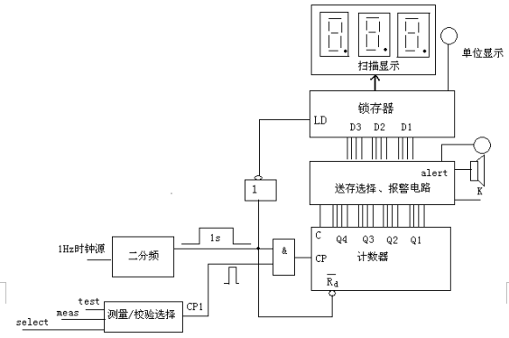

# Assignment 3

Complete Digital Frequency Meter.

Design requirements:

1. VHDL design and simulation completed 12-bit decimal digits frequency meter.

2. Frequency measuring range 1Hz ~ 10KHz, divided into two bands, namely 1 ~ 999Hz and 1KHz ~ 10KHz, with 3-bit digital display of measured frequency, with LED display showing the unit, such as a green light indicates Hz, red indicates KHz.

3. With automatic calibration and measurement two functions that use standard clock calibration, measurement accuracy.

4. With over-range alarm function when beyond the current range for the measuring range, emit light and sound signals.

