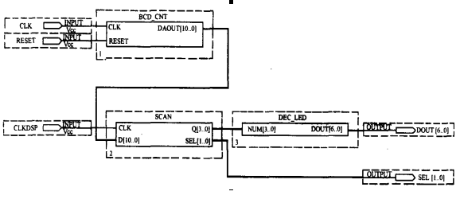

# Assignment 2 #

Complete count display circuit.

Design requirements:

* 3-bit BCD code output for the count display circuit.

* The count display circuit consists of 3 modules:

    - decimal counter (BCD_CNT)

    - seven segment display decoder circuit (DEC_LED)

    - sharing bus switching circuit (SCAN).

* According to the logic diagram using hierarchical design method, circuit shown in FIG.

    

